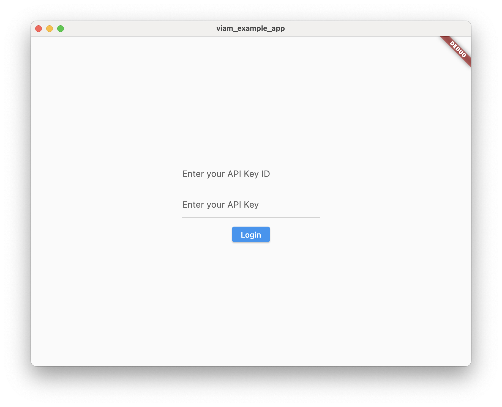
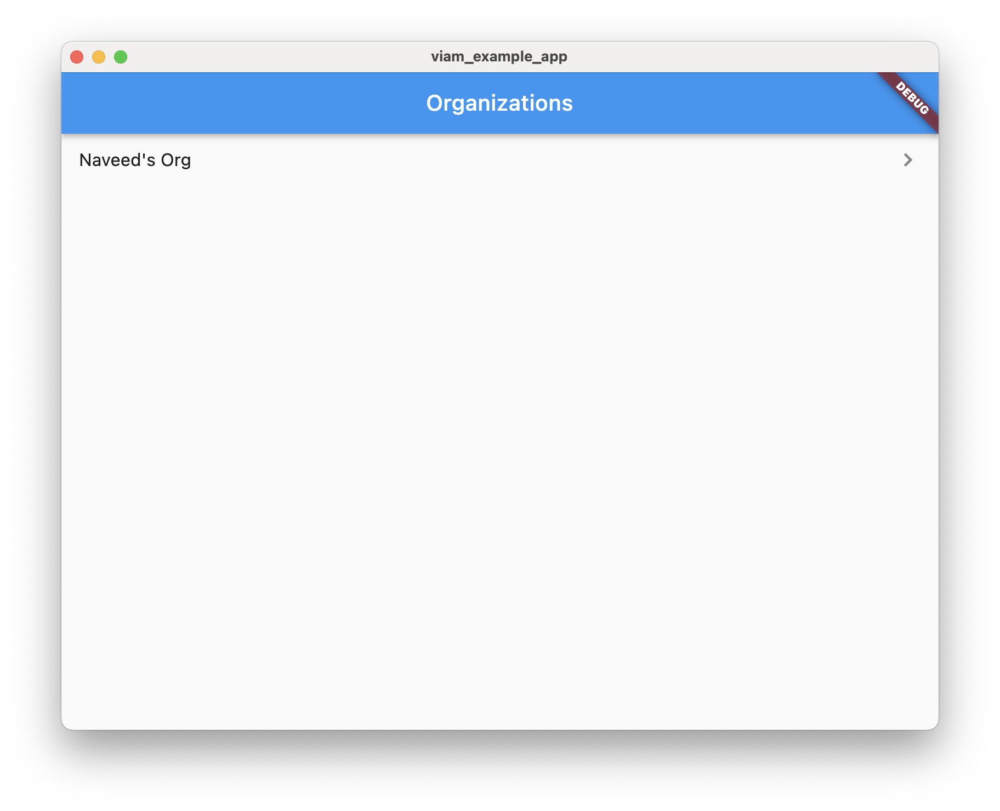
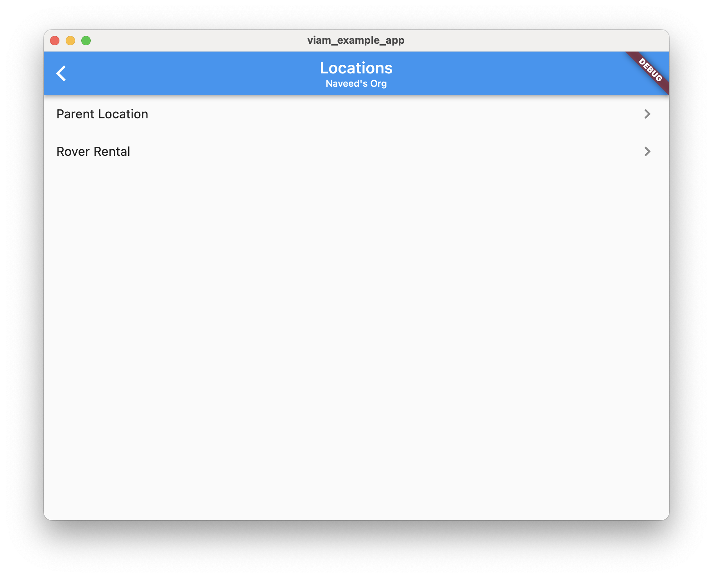
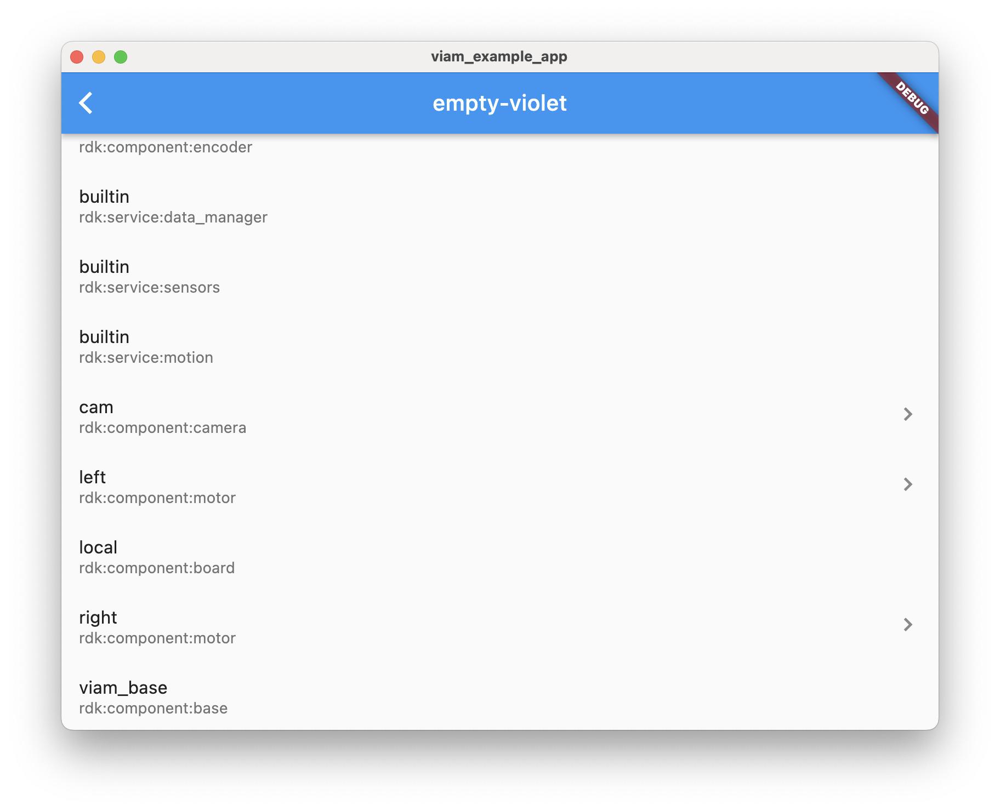
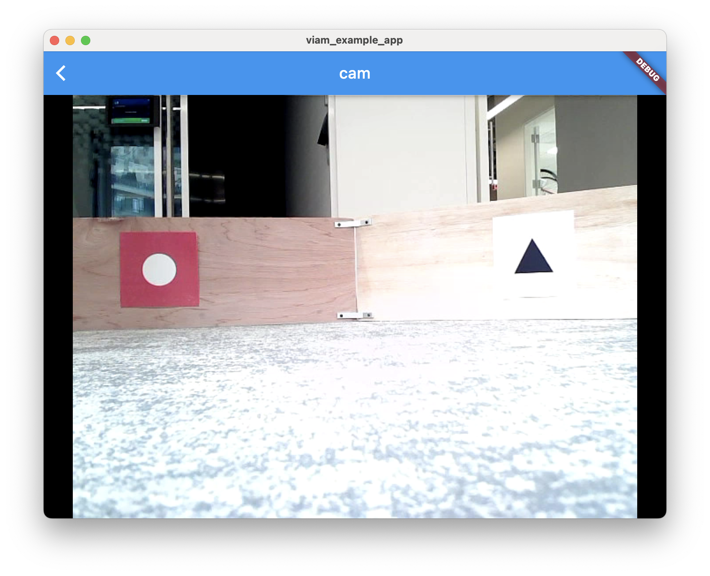
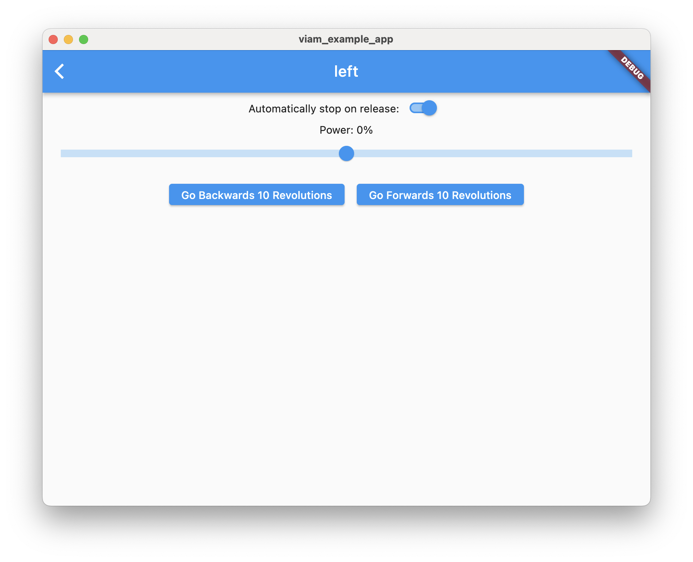

# Viam Example Flutter App

This example app uses Viam's Flutter SDK to connect to and control a robot. It was created using VSCode's Flutter plugin and shows the basic use cases for how the Viam Flutter SDK can be used to connect manage your fleet of robots.

The app is well documented and will walk you through how to use your API Keys to connect to Viam, manage your fleet of robots, and even control a particular robot using the [SDK's builtin widgets](https://github.com/viamrobotics/viam-flutter-sdk/tree/main/lib/widgets) and custom widgets.

Screenshots of the final product can be found [below](#screenshots).

## Setup

### API Keys

This example app requires the use of API Keys. You can obtain an API Key by following the [documentation](https://docs.viam.com/manage/cli/#create-an-organization-api-key).

You can either hardcode your API Key into a `.env` file, or you can input your API Key ID an API Key every time you use this example app. In either case, you should first rename the `.env.template` file to simply `.env`.

If you would like to hardcode your API Key, you should set the `API_KEY_ID` and `API_KEY` fields in the `.env` file with your API Key ID and API Key. If you wish to dynamically enter your API Key ID and API Key, you can leave these fields blank.

Your `.env` file should look like:

```
API_KEY_ID=<API KEY ID>
API_KEY=<API KEY>
```

where the values in the angle brackets are either your API Key values or empty.

### Permissions

Next, you'll have to update some permissions.

On many operating systems, apps are not granted access to the internet by default. To update these permissions, follow the steps below for whichever operating system you are targeting.

**Android**

Android apps must declare their use of the internet in the Android manifest (`android/app/src/main/AndroidManifest.xml`):

```xml
<manifest xmlns:android...>
 ...
 <uses-permission android:name="android.permission.INTERNET" />
 <application ...
</manifest>
```

**macOS**

macOS apps must allow network access in the relevant `.entitlements` files (`macos/Runner/{DebugProfile | Release}.entitlements`).

```xml
<key>com.apple.security.network.client</key>
<true/>
```

## Structure

This app was generated using Flutter's built-in app creation tools, so it has the same structure as most Flutter starter apps. That makes it a great jumping off point for your own new app, or an easily navigable reference app.

The code is verbosely documented to help you understand how to use the Viam SDK in a Flutter app.

To navigate the code, you should first start by looking in the `lib/main.dart` file. There, you'll find comments directing you to other files, which themselves are also documented.

## Run

To run the app, you should run the `lib/main.dart` file:

```sh
flutter run lib/main.dart
```

## Screenshots

- [**Login Screen**](https://github.com/viamrobotics/viam-flutter-sdk/tree/main/example/viam_example_app/lib/login_screen.dart): This is the screen you will see if you don't provide API Key values in the `.env` file.
  

- [**Home Screen**](https://github.com/viamrobotics/viam-flutter-sdk/tree/main/example/viam_example_app/lib/home_screen.dart): This is the screen that lists all the organizations your API Key has access to.
  

- [**Organization Screen**](https://github.com/viamrobotics/viam-flutter-sdk/tree/main/example/viam_example_app/lib/organization_screen.dart): A specific organization's screen. Displays the top-level locations of the organization.
  

- [**Location Screen**](https://github.com/viamrobotics/viam-flutter-sdk/tree/main/example/viam_example_app/lib/location_screen.dart): Shows the sub-locations and robots available within this location.
  

- [**Robot Screen**](https://github.com/viamrobotics/viam-flutter-sdk/tree/main/example/viam_example_app/lib/robot_screen.dart): Displays the resources available on a robot.
  

- [**Camera Screen**](https://github.com/viamrobotics/viam-flutter-sdk/tree/main/example/viam_example_app/lib/resources/camera_screen.dart): One way to show a live camera feed, using the SDK's builtin [`ViamCameraStreamView`](https://github.com/viamrobotics/viam-flutter-sdk/tree/main/lib/widgets/camera_stream.dart)).
  

- [**Motor Screen**](https://github.com/viamrobotics/viam-flutter-sdk/tree/main/example/viam_example_app/lib/resources/motor_screen.dart): An example for controlling a motor using both the SDK's builtin [`ViamMotorWidget`](https://github.com/viamrobotics/viam-flutter-sdk/tree/main/lib/widgets/resources/motor.dart), as well as two custom widgets.
  
